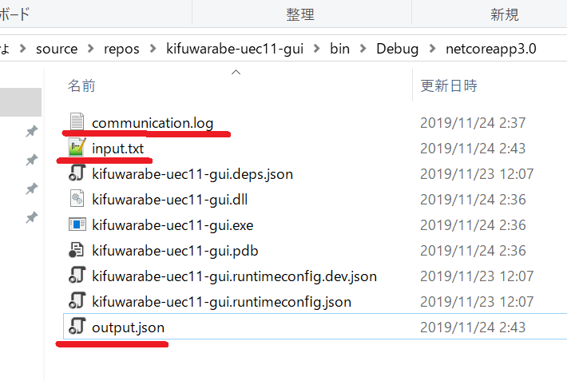
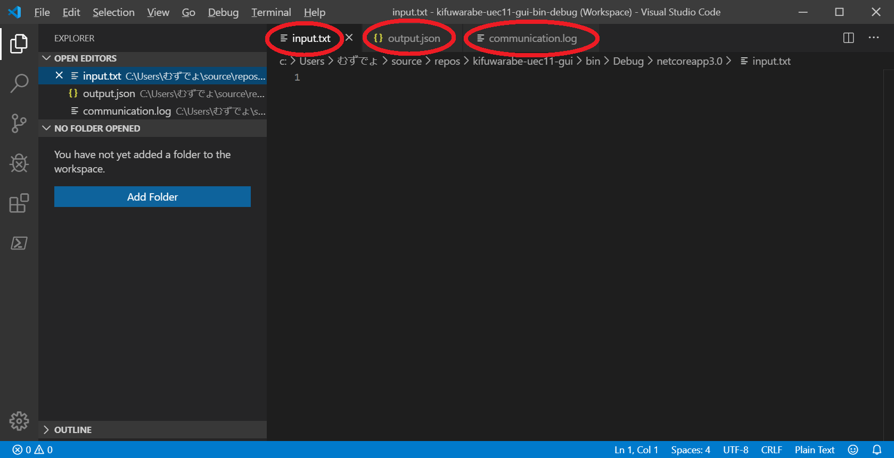
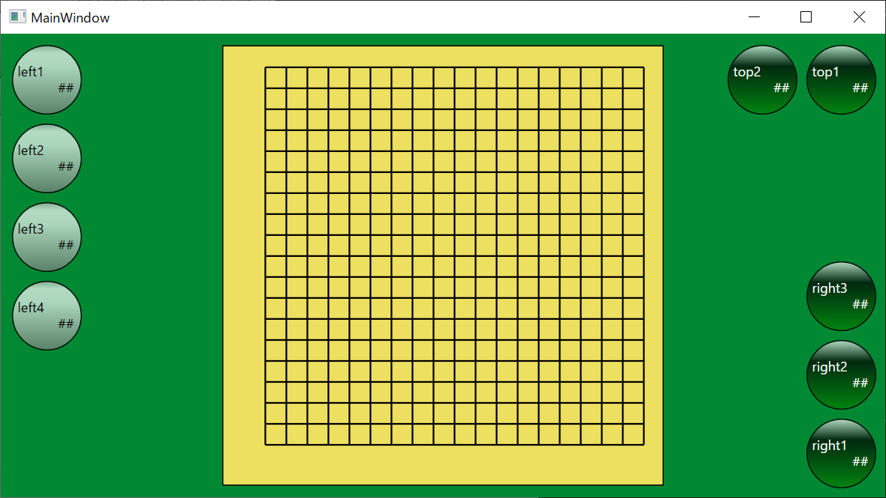
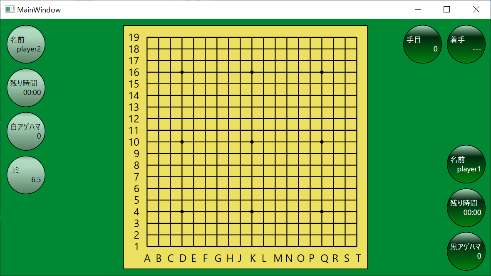
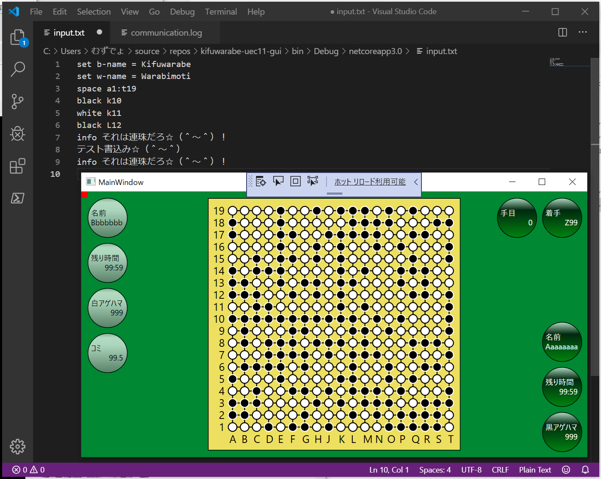
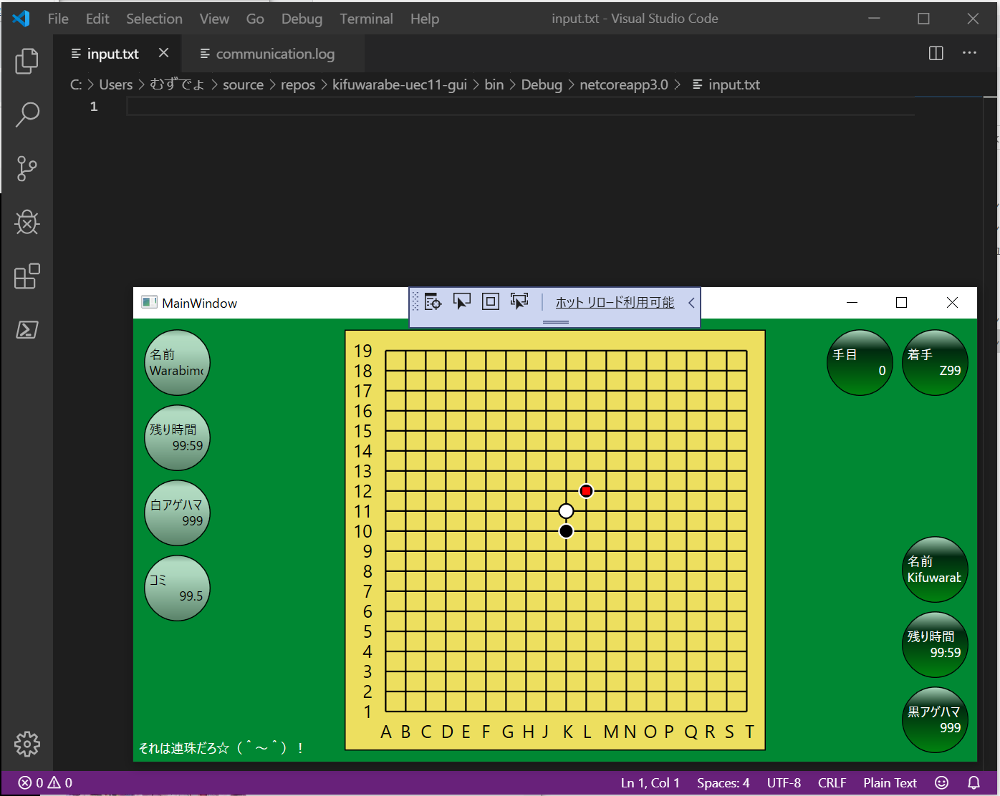

# Script API


このプログラムは何を書いているのか……という顔をしているお前らのために。


# テキスト・ファイル入出力 という謎のシステム☆（＾～＾）

  

↑主役は ３つのテキスト・ファイルだぜ☆（＾～＾）

* input.txt
* output.json
* communication.log

  

↑この３つのファイルを Visual studio code で開いておけば、そこらへんの GUIソフトと似たような機能を実現できるぜ☆（＾～＾） 合理的だな☆

  

↑ `kifuwarabe-uec11-gui.exe` をダブル・クリックすれば、初期画面が出てくるぜ☆（＾～＾）  
囲碁の１９路盤でも、９路盤でも、連珠の１５道盤でも対応できるように　フレームワーク　にしてある☆（＾～＾）  
じゃあ、囲碁盤にセットアップする方法を説明しよう☆（＾～＾）  

`input.txt` に以下のテキストをベタっと貼り付けて、保存しろだぜ☆（＾～＾）

```
# UIの別名
alias top1 = move
alias top2 = ply
alias right1 = b-hama
alias right2 = b-time
alias right3 = b-name
alias left1 = w-name
alias left2 = w-time
alias left3 = w-hama
alias left4 = komi

# UIの初期表示。typeを最初に決める必要があるぜ☆（＾～＾）
set move.type  = string
set move.title = 着手
set move       = ---

set ply.type  = number
set ply.title = 手目
set ply       = 0

set b-name.type  = string
set b-name.title = 名前
set b-name       = player1

set b-time.type  = string
set b-time.title = 残り時間
set b-time       = 00:00

set b-hama.type  = number
set b-hama.title = 黒アゲハマ
set b-hama       = 0

set w-name.type  = string
set w-name.title = 名前
set w-name       = player2

set w-time.type  = string
set w-time.title = 残り時間
set w-time       = 00:00

set w-hama.type  = number
set w-hama.title = 白アゲハマ
set w-hama       = 0

set komi.type  = number
set komi.title = コミ
set komi       = 6.5

# WIP
# set move-marker.type    = string
# set move-marker         = A1
# set move-marker.visible = false

# 特殊な設定☆（＾～＾）
set row-size = 19
set column-size = 19

# 国際囲碁では I列は無いんだぜ☆（＾～＾）
set column-numbers = "A", "B", "C", "D", "E", "F", "G", "H", "J", "K", "L", "M", "N", "O", "P", "Q", "R", "S", "T"
set row-numbers = "19", "18", "17", "16", "15", "14", "13", "12", "11", "10", "  9", "  8", "  7", "  6", "  5", "  4", "  3", "  2", "  1"
set stars = "D16", "K16", "Q16", "D10", "K10", "Q10", "D4", "K4", "Q4"

# 盤の初期配置☆（＾～＾） 行番号を決めたあとにしろだぜ☆（＾～＾）
board 19 ...................
board 18 ...................
board 17 ...................
board 16 ...................
board 15 ...................
board 14 ...................
board 13 ...................
board 12 ...................
board 11 ...................
board 10 ...................
board  9 ...................
board  8 ...................
board  7 ...................
board  6 ...................
board  5 ...................
board  4 ...................
board  3 ...................
board  2 ...................
board  1 ...................

# 指し手でもあれば入れとけだぜ☆（＾～＾）
put black to D16
set move = D16
put white to Q4
set move = Q4
put black to P4
set move = P4
```

すると２秒後ぐらいには `input.txt` は読み取られて空っぽのファイルになっている☆（＾～＾）

  

↑そして　囲碁盤のようにセットされる☆（＾～＾）  
石を置くときは　以下のコマンドを打てだぜ☆（＾～＾）

```
put black to D16
set move = D16
```

  

↑１行ずつコマンドを入れて保存すれば、何に効いているのか　分かるだろう☆（＾～＾）


# 連珠盤に変える例

初期状態を連珠盤にしたかったら これを続けて入力しろだぜ☆（＾～＾）ダイナミックだろ☆（＾～＾）

Example:

```
# UIの別名
alias top1 = move
alias top2 = ply
alias right1 = b-time
alias right2 = b-name
alias left1 = w-name
alias left2 = w-time

# UIの初期表示。typeを最初に決める必要があるぜ☆（＾～＾）
set move.type       = string
set move.title      = 着手
set move            = ---
set move.visible    = true

set ply.type        = number
set ply.title       = 手目
set ply             = 0
set ply.visible     = true

set b-name.type     = string
set b-name.title    = 名前
set b-name          = Kifuwarabe
set b-name.visible  = true

set b-time.type     = string
set b-time.title    = 残り時間
set b-time          = 00:00
set b-time.visible  = true

set right3.type     = null
set right4.type     = null

set w-name.type     = string
set w-name.title    = 名前
set w-name          = Warabemoti
set w-name.visible  = true

set w-time.type     = string
set w-time.title    = 残り時間
set w-time          = 00:00
set w-time.visible  = true

set left3.type      = null
set left4.type      = null
set left5.type      = null

# 特殊な設定☆（＾～＾）
set row-size = 15
set column-size = 15

set column-numbers = "a", "b", "c", "d", "e", "f", "g", "h", "i", "j", "k", "l", "m", "n", "o"
set row-numbers = "15", "14", "13", "12", "11", "10", "  9", "  8", "  7", "  6", "  5", "  4", "  3", "  2", "  1"
set stars = "d4", "l4", "h8", "d12", "l12"

# 盤の初期配置☆（＾～＾） 行番号を決めたあとにしろだぜ☆（＾～＾）
board 15 ...............
board 14 ...............
board 13 ...............
board 12 ...............
board 11 ...............
board 10 ...............
board  9 ...............
board  8 ...............
board  7 ...............
board  6 ...............
board  5 ...............
board  4 ...............
board  3 ...............
board  2 ...............
board  1 ...............

# 指し手でもあれば入れとけだぜ☆（＾～＾）
put black to h8
set move = h8
put white to h9
set move = h9
put black to i10
set move = i10
```


# 古いが多分まだ使える説明

  
↑  

1. Visual studio code を使って `./input.txt` ファイルを開けだぜ☆（＾～＾） ファイルをロックせず、ファイルの内容がリアルタイムに反映される優れものだぜ☆（＾～＾）
2. お前は input.txt に何かテキストを打ち込むといいだろう☆（＾～＾）　そして [Ctrl]+[S]キーでも使ってファイルを保存したら　キーボードから手を放せだぜ☆（＾～＾） 触んな☆ｍ９（＾～＾） 
3. `kifuwarabe-uec11-gui.exe` は 2秒間隔ぐらいで `./input.txt` ファイルを ファイルをロックせずに覗き見にくるぜ☆（＾～＾）

  
↑  

4. `kifuwarabe-uec11-gui.exe` は input.txt ファイルの内容が が空でなければ 消す☆（＾～＾） そのときテキストは複数行コマンド（スクリプト）として読み込むぜ☆（＾～＾）
5. お前は Visual studio code で `input.txt` ファイルの中身が消えたことに顔色を真っ青にしながら　つぎのテキストを打てだぜ☆（＾～＾）
6. `kifuwarabe-uec11-gui.exe` は input.txt を消しもするが `communication.log` にも書き出している☆（＾～＾）　調子乗って長文書いたら１つのファイルが膨れ上がるからな☆ｍ９（＾～＾）


# 部品は汎用化していくので、まず囲碁用にセットする必要があるぜ☆（＾～＾）

プリセットとかいう甘えはない☆（＾～＾）


↑画面上の表示欄に、別名を付けておかないと使えたものではないからな☆（＾～＾）


# 行頭 `#` はコメント


Example:


```
#banana
# banana
## banana
 #banana
 # banana
```


# このアプリケーションを すごいすんなり終了させるなら `exit`


Example:

```
exit
exit banana
```


最初の単語で判定している☆（＾～＾） たった４文字の短いキータイピングで このアプリケーションのウィンドウ閉じる（終わる）からな☆（＾～＾） いいのかそれで☆（＾～＾）  


# 画面に　ちょこっと　大して重要でもないメッセージを表示するなら `info`


Example:


```
info 勉強したって無駄だぜ☆（＾～＾）\n 世の中に天才はいっぱいいる割に天才の使い方を知っている凡人は少ない☆（＾～＾）\n　ふてくされてだらだらと人工知能でも作って無意味に過ごそうぜ☆（＾～＾）\n　お前はまずひまつぶしにラムダ計算から入門して数論に進みマルチ・コア・プログラミングを覚えて全ての数学者・物理学者・プログラマーを倒せだぜ☆ｍ９（＾～＾）\n 簡単だろ☆（＾ｑ＾）
```


勝率とか勝敗はこれで描けだぜ☆（＾～＾）  


Escape sequence:  

| Typing | Description |
| ------ | ----------- |
| `\n`   | 改行        |
| `\\`   | `\`         |

それ以外のエスケープ文字は全部無効☆（＾～＾）  


# 名前=値 になってるのを設定するのは `set`

`real-name` (本名) と、 `alias-name` (別名) の２種類あることを見分けろだぜ☆（＾～＾）  

| Item       | Description                                                          |
| ---------- | -------------------------------------------------------------------- |
| real name  | `top1` とか `left2` みたいなやつ。ファイルに保存されるときはこっち。 |
| alias name | `move` とか `b-name` みたいなやつ。                                  |

打鍵して入力するときは、`real-name` でも `alias-name` でもどっちでも使えるが、 `alias-name` を使わないとやってられないぜ☆   


Format:


```
set {real-name} = {value}
set {real-name}.{property} = {value}

set {alias-name} = {value}
set {alias-name}.{property} = {value}
```


Example:


```
set move.type    = string
set move.title   = 着手
set move.visible = true
set move         = K10
```


| alias         | type   | description                                                                                                                                                                                                                                                                                                                                                 |
| ------------- | ------ | ----------------------------------------------------------------------------------------------------------------------------------------------------------------------------------------------------------------------------------------------------------------------------------------------------------------------------------------------------------- |
| b-hama        | number | 黒番のアゲハマ☆（＾～＾）取り揚げた白石の数だぜ☆（＾～＾）<br/>日本ルールだけ使う☆（＾～＾）<br/>白石はハマグリで出来てるのが由来でハマといえば石のことだぜ☆（＾～＾）                                                                                                                                                                                      |
| b-name        | string | 黒番の氏名☆（＾～＾）                                                                                                                                                                                                                                                                                                                                       |
| b-time        | string | 黒番の持ち時間☆（＾～＾）飾り☆（＾～＾）<br/>とりあえず `23:59` みたいな書式で入れとけだぜ☆（＾～＾）                                                                                                                                                                                                                                                       |
| column-size   | number | 列数☆（＾～＾） 0～19☆（＾～＾）                                                                                                                                                                                                                                                                                                                            |
| info          | string | GUIの画面上にちょこっと文字を表示する、とって付けたような機能☆（＾～＾）<br/>シンタックス・シュガーの `info message` 構文の方を使えだぜ☆（＾～＾）                                                                                                                                                                                                          |
| interval-msec | number | `input.txt` を読みに来る間隔だぜ☆（＾～＾）<br/>ミリ秒で指定できるが、短すぎるとマシンがイカれるぜ☆（＾～＾）                                                                                                                                                                                                                                               |
| komi          | number | コミ☆（＾～＾）<br/>囲碁は先手黒番有理なんで、白にあげるハンディキャップだぜ☆（＾～＾）<br/>昭和初期まで先後２番打ってたが、１番で済ませたくなって<br/>互先（たがいせん）ルールが作られて使われ始めた☆（＾～＾）<br/>コミがいくつかはプロの公式戦の先後の勝率を見て稀に更新されている☆<br/>えっ、話しが長いだって☆（＾～＾）？お前が黙ってろだぜ☆（＾～＾） |
| move          | string | 最後の着手☆（＾～＾） `A1` とか入れろだぜ☆（＾～＾）                                                                                                                                                                                                                                                                                                        |
| ply           | number | 何手目か☆（＾～＾）                                                                                                                                                                                                                                                                                                                                         |
| row-size      | number | 行数☆（＾～＾） 0～19☆（＾～＾）                                                                                                                                                                                                                                                                                                                            |
| w-hama        | number | 白番のアゲハマ☆（＾～＾）                                                                                                                                                                                                                                                                                                                                   |
| w-name        | string | 白番の氏名☆（＾～＾）                                                                                                                                                                                                                                                                                                                                       |
| w-time        | string | 白番の持ち時間☆（＾～＾）                                                                                                                                                                                                                                                                                                                                   |


# 盤に石を置くなら `put ~ to ~` を使いこなせだぜ☆（＾～＾）


大文字、小文字は区別する☆（＾～＾）　列には１桁のアルファベット、行には１～２桁の自然数があるものとするぜ☆（＾～＾）

Example:


```
# 1個
put black to H1
put white to J10
put space to T19

# 複数個
put black to A1 B2 C3 D4

# 矩形塗りつぶし
put black to A1:C3

# 混合
put white to A1 B2:D4 E5 F6:H8
```

お絵描きができるな☆（＾～＾）

UIに 着手の符号を 自動的に表示してくれたりはしない☆（＾～＾） コマンドを打てだぜ☆（＾～＾）

```
set move = K10
```


# ウィジェットを非表示にしたいなら `set ～.visible` コマンドを使えだぜ☆（＾～＾）

Example:

```
set b-hama.visible = false
set w-hama.visible = false
set komi.visible = false
```

効くやつ、効かないやつがあるのは実装が適当だからだぜ☆（＾～＾）


| alias          | Description         |
| -------------- | ------------------- |
| ply            | 何手目              |
| move           | 最後の着手          |
| b-name         | 先手（黒番）の氏名  |
| b-time         | 黒の持ち時間        |
| b-hama         | 黒のアゲハマ        |
| w-name         | 後手（白番）の氏名  |
| w-time         | 白の持ち時間        |
| w-hama         | 白のアゲハマ        |
| komi           | 白のコミ            |
| row-numbers    | 行番号☆（＾～＾）   |
| column-numbers | 列番号☆（＾～＾）   |
| stars          | 盤上の星☆（＾～＾） |


# 盤面の入力☆（＾～＾）


```
board 19 bbbbbwwwww.....bbbb
board 18 bbbbbwwwww.....bbbb
board 17 bbbbbwwwww.....bbbb
# 以下略☆（＾～＾）
```


１９行目に石を置くとき、 `board` コマンドを使っても置ける☆（＾～＾）


| Char | Description |
| ---- | ----------- |
| b    | 黒石        |
| w    | 白石        |
| .    | 空点        |


# `output.json` 読み込めねーの☆（＾～＾）？


```
json {ここにJSONのテキスト貼り付けろだぜ☆（＾～＾）}
```


プログラム内部のデータ構造とピッタリ合わせる必要があるからな☆（＾～＾）　わたしが　内部仕様をちょちょっと変えるたびに　古い JSON は読み込めなくなるぜ☆（＾～＾）


